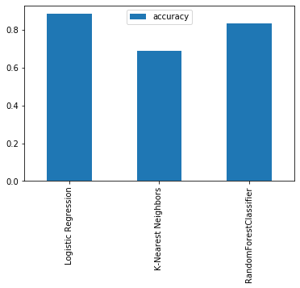

# Heart Disease Predictor

This notebook looks into using various python-based machine learning and data science libraries in an attempt to build a machine learning model capable of predicting whether or not someone has heart disease (classification) based on their medical attributes.

## Getting Started

These instructions will get you a copy of the project up and running on your local machine for development and testing purposes.

### Dataset
The heart disease dataset was obtained from the [**UCI Machine Learning Repository**](https://archive.ics.uci.edu/ml/datasets/heart+Disease). This database contains 76 attributes, but all published experiments refer to using a subset of 14 of them. The dataset can be found inside the `data` folder.

### Prerequisites

#### Data science toolkit

First of all we need a data science toolkit. You can either go for **Anaconda** or **Miniconda** based on your requirements.
- **Anaconda** - [Link](https://www.anaconda.com/products/individual)
- **Miniconda** - [Link](https://docs.conda.io/en/latest/miniconda.html)

### Installation

After you're done installing the data science toolkit its time to setup the project folder containing all the mandatory libraries. Follow the step by step procedure which explains you how to get your development environment running.

- **Clone GitHub repository** <br>
    Find a location on your computer where you want to store the project. Now, run the following command to pull the project from GitHub and create a copy of it. And `cd` into the project.
    ```
    https://github.com/Brijesh097/heart-disease-predictor.git
    ```
    
    
- **Create an environment folder and install the libraries** <br>
    We'll be using libraries such as **Pandas**, **NumPy**, **Scikit-learn**, **Matplotlib**, **Seaborn** and **Jupyter Notebook** to write and execute the code.
    ```
    conda create --prefix ./env pandas numpy scikit-learn matplotlib seaborn jupyter
    ```


- **Activate the environment** <br>
    After all the mandatory libraries have been installed we can activate the environment by executing the following command.
    ```
    conda activate <path_of_env>
    ```
    
    You can also view all the environments by executing the below command
    ```
    conda env list
    ```
    
    To deactivate an environment, use
    ```
    conda deactivate
    ```
    
- **Open the notebook** <br>
    To view the `heart-disease-classifier.ipynb` notebook, use
    ```
    jupyter notebook
    ```
    You can view all the files and folders of the current directory here.
    
    
## Framework

The problem was approached using the following machine learning modelling framework:


## Model Selection

The following models were used and their results were compared:
1. **Logistic Regression** - [LogisticRegression()](https://scikit-learn.org/stable/modules/generated/sklearn.linear_model.LogisticRegression.html)
2. **K-Nearest Neighbors** - [KNeighboursClassifier()](https://scikit-learn.org/stable/modules/generated/sklearn.neighbors.KNeighborsClassifier.html)
3. **RandomForest** - [RandomForestClassifier()](https://scikit-learn.org/stable/modules/generated/sklearn.ensemble.RandomForestClassifier.html)



## Evaluation

After comparison `LogisticRegression` stood out as the best model. So, did some hyperparameter tuning using `RandomSearchCV` and `GridSearchCV` and the accuracy turned out to be **88.52%**.

## Author

* **Brijesh Reddy**  ([Brijesh097](https://github.com/Brijesh097))
